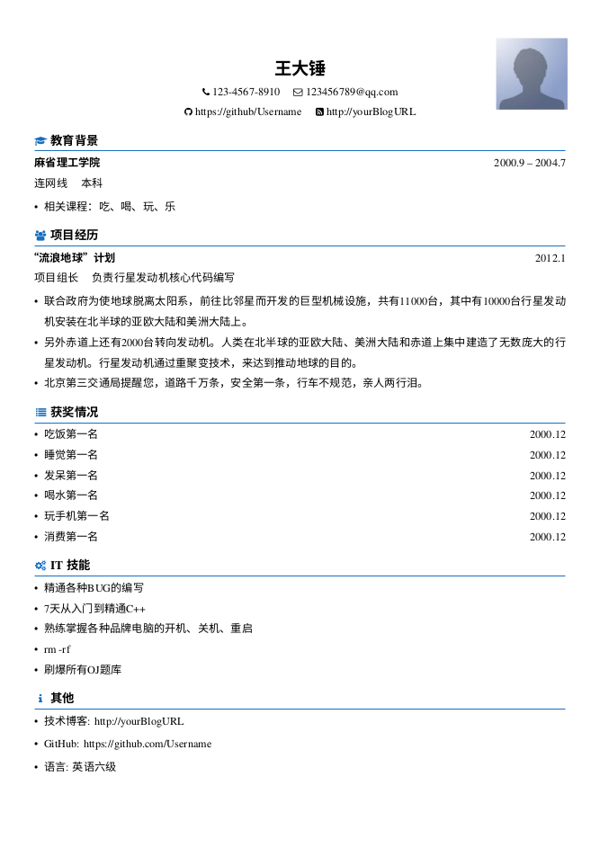

# 基于Latex的简历模板

## 参考：

- [billryan/resume](https://github.com/billryan/resume)

- [Htallone/myCV](https://github.com/Htallone/myCV)

在[Htallone/myCV](https://github.com/billryan/resume)的基础上进行了微小的修改

## 模板



## 说明
该模板为带照片的Latex模板，若不想带个人照片，可删除**myCV-Photo.tex**中的相关代码

### 字体
因为字体涉及版权的原因，所以Font目录下相关的字体为空，需要自己添加相关的文件，修改**myCV-Photo.tex**相关的代码

引用了**fontawesome**的Icons

### 编译
```
make
make clean
```

# License
[The MIT License (MIT)](http://opensource.org/licenses/MIT)。

